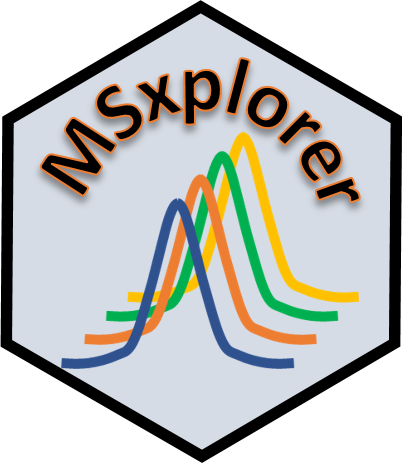

<!-- README.md is generated from README.Rmd. Please edit that file -->

# MSxplorer



<!-- badges: start -->
<!-- badges: end -->

The goal of MSxplorer is to provide interactive tools to explore data
independent analysis (DIA) HRMS chemical analysis. It is currently only tested on Waters
LC-HRMS MSe data. Some funtionalities can also be used on GC-HRMS data.

## Installation

<!-- You can install the released version of MSXploreR from [CRAN](https://CRAN.R-project.org) with: -->
<!-- ``` r -->
<!-- install.packages("MSxplorer") -->
<!-- ``` -->

And the development version from [GitHub](https://github.com/) with:

``` r
# install.packages("devtools")
devtools::install_github("WBS-TW/MSxplorer")
```

## Example

``` r
library(MSxplorer)
## basic example code
```
